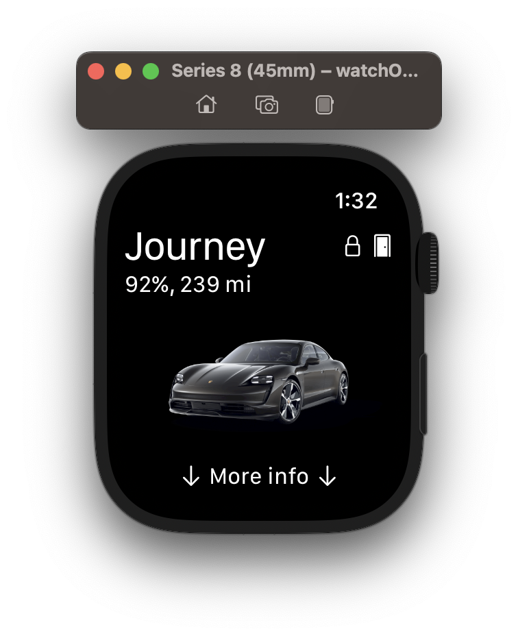
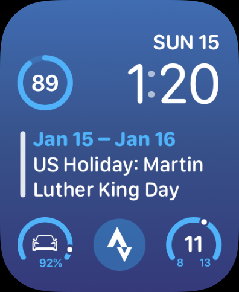

# Electric Sidecar

An unofficial Apple Watch app for the Porsche Taycan.

| App | Complications |
|:----|:--------------|
|  |  | 

## Supported features

- Standalone watchOS app. Requires watchOS 9.1.
- Watch app shows:
  - Charge percentage
  - Range
  - Indication of whether the car is charging or not
  - Overall locked / closed status
  - Position
  - VIN
- Watch app supports multiple cars.
- Complications:
  - Charge (supports: circular, inline, and corner): shows the car's current charge and whether the car is charging or not.
  - Closed / locked status (supports: circular): shows the car's overall locked / closed status.

## How to get it

If you would like to join the TestFlight, email jverkoey@gmail.com

## How to use it

Once installed, log in with your Porsche credentials. These credentials will stay on your device
and only be used with the Porsche APIs for the purposes of authentication.

## Community

Join our Discord at: https://discord.gg/hPeqFkmaDb
